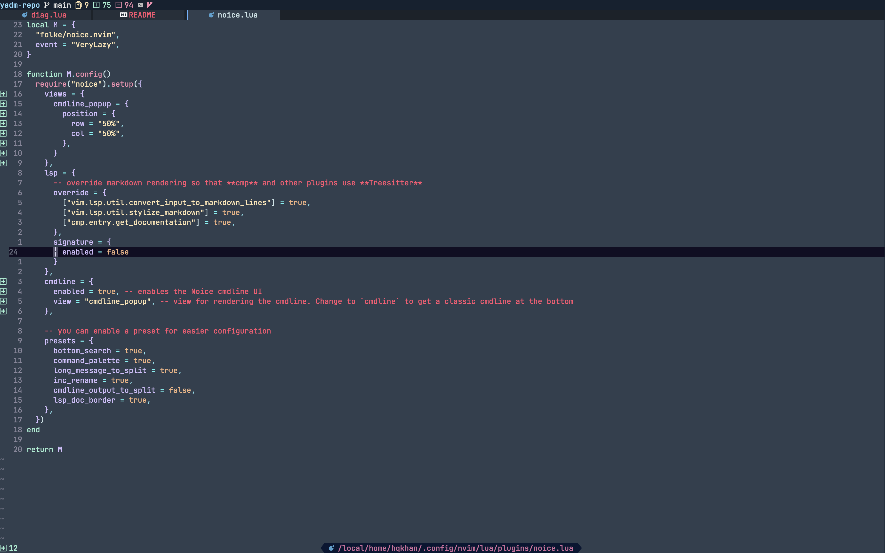

# Config for neovim + basic terminal stuff
[Yadm](https://yadm.io/docs/overview) repo holding all config. 
[Second repo](https://github.com/hqkhan/config) holding misc config.

Bootstrap script by iBhagwan: `yadm.sh`

Steps to get setup on new machine:

1. Create $HOME/bin
2. Create $HOME/dots
3. Copy `yadm.sh`'s contents into an executable script
4. Execute script

# Config

# Software

- Terminal: [Alacritty](https://alacritty.org)
- Font: [JetBrains Nerd Font](https://github.com/JetBrains/JetBrainsMono)
- Colors: [embark](https://github.com/embark-theme/vim)
- Shell: bash
- Multiplexer: [tmux](https://github.com/tmux/tmux/wiki)
- Editor: [Neovim](https://neovim.io)
- Git: [lazygit](https://github.com/jesseduffield/lazygit)
- macOS package manager: [Homebrew](https://brew.sh)
- Hotkeys: [Hammerspoon](https://www.hammerspoon.org/) & [skhd](https://github.com/koekeishiya/skhd/)

## Browser setup (Firefox)

- [uBlock Origin](https://addons.mozilla.org/en-US/firefox/addon/ublock-origin/)
- [Tree Style Tab](https://addons.mozilla.org/en-US/firefox/addon/tree-style-tab/) + [AutoTabDiscard](https://webextension.org/listing/tab-discard.html)
- [Darkreader](https://darkreader.org/)
- [TamperMonkey](https://www.tampermonkey.net/)
- [SurfingKeys](https://github.com/brookhong/Surfingkeys)
